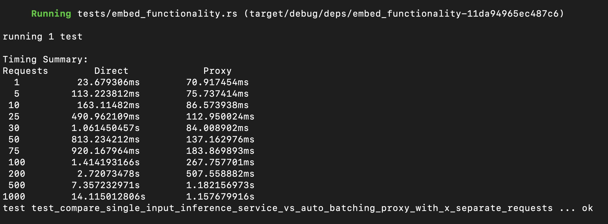

# Auto Batching Proxy

It will automatically batch inference requests from multiple independent users together in a single batch request for efficiency, so that for users the interface looks like individual requests, but internally it is handled as a batch 
request, essentially it provide a REST API wrapper around some inference service like https://github.com/huggingface/text-embeddings-inference


Proxy server is configured with following parameters:

_Max Wait Time_ - maximal time user request can wait for other requests to be accumulated in a batch  
_Max Batch Size_ - maximal number of requests that can be accumulated in a batch.

## Setup Inference Service 
First, try running inference service in a container with `--model-id nomic-ai/nomic-embed-text-v1.5`
```
docker run --rm -it -p 8080:80 --pull always \
    ghcr.io/huggingface/text-embeddings-inference:cpu-latest \
--model-id nomic-ai/nomic-embed-text-v1.5
```
if it fails to start, then try with some other alternatives. Currently, code is functional for  
`--model-id sentence-transformers/all-MiniLM-L6-v2` & `--model-id sentence-transformers/all-mpnet-base-v2`
Check [/screenshots](./screenshots) for some of the tried models.

```
docker run --rm -it -p 8080:80 --pull always \
  ghcr.io/huggingface/text-embeddings-inference:cpu-latest \
  --model-id sentence-transformers/all-MiniLM-L6-v2
```
Note: [Backend does not support a batch size > 8](screenshots/run_model_status/max_batch_size.png)
but our proxy will respect this config param & will not send requests (as well as max inputs, which is 32 for `all-MiniLM-L6-v2`) more than supported batch size. 

## Setup Proxy Service
- either run `cargo run` at root of the project, it will launch Rocket [with default configuration params](./screenshots/cargo/cargo_run.png)
- or otherwise [with custom params](./screenshots/cargo/cargo_run_with_params.png) like 
```
RUST_LOG=INFO cargo run -- --max-batch-size 50 --max-wait-time-ms 3000
```


**[Unit tests](https://doc.rust-lang.org/book/ch11-03-test-organization.html#unit-tests)**   
Relevant unit tests are provided inside `/src` source code files

**[Integration tests](https://doc.rust-lang.org/book/ch11-03-test-organization.html#integration-tests)**  
Check the `/tests` folder, code is covered with various scenarios.

Run all tests via `cargo test`. Currently, tests are verified to be passed against  
`--model-id sentence-transformers/all-MiniLM-L6-v2` & ` --model-id sentence-transformers/all-mpnet-base-v2`
& they also explain how/why which part of code was written for which particular use case.

Use the following simple CURL commands for quick testing
- for inference
```
curl -X POST http://localhost:8080/embed \
  -H "Content-Type: application/json" \
  -d '{"inputs": ["Hello world"]}'
```
- for proxy
```
curl -X POST http://localhost:3000/embed \
  -H "Content-Type: application/json" \
  -d '{"inputs": ["Hello", "World"]}'
```
to verify proxy is working for multiple concurrent requests 
```
cd scripts 
./proxy_concurrent_calls.sh
```

**Benchmark test results:**  
Following output is taken from 
```
$ RUSTFLAGS="-A dead_code" cargo test test_compare_single_input_inference_service_vs_auto_batching_proxy_with_x_separate_requests -- --nocapture
```
- `-A` shortcut for allow (to suppress warnings generated for unused functions, even though they are actually used in tests) 
- [--nocapture](https://doc.rust-lang.org/cargo/commands/cargo-test.html#display-options) will recover display output 

[Full output:](./screenshots/timing_summary_full.png)

